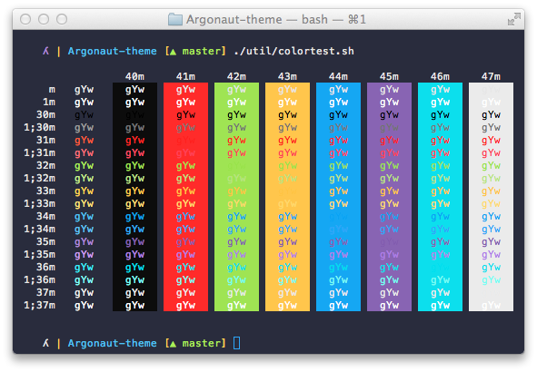
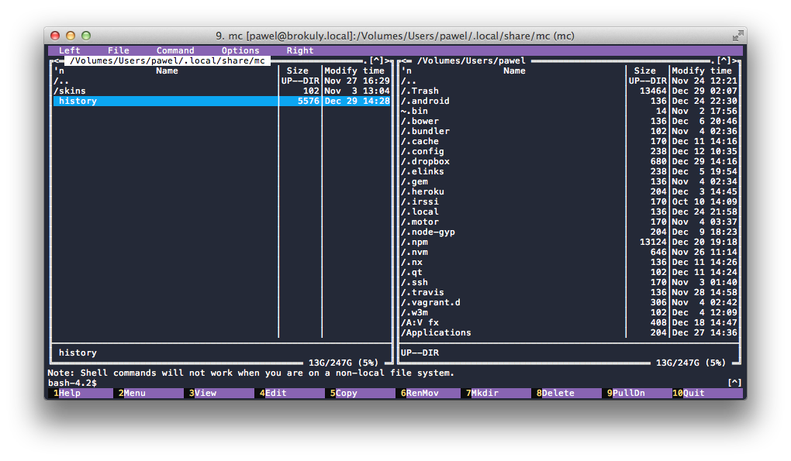
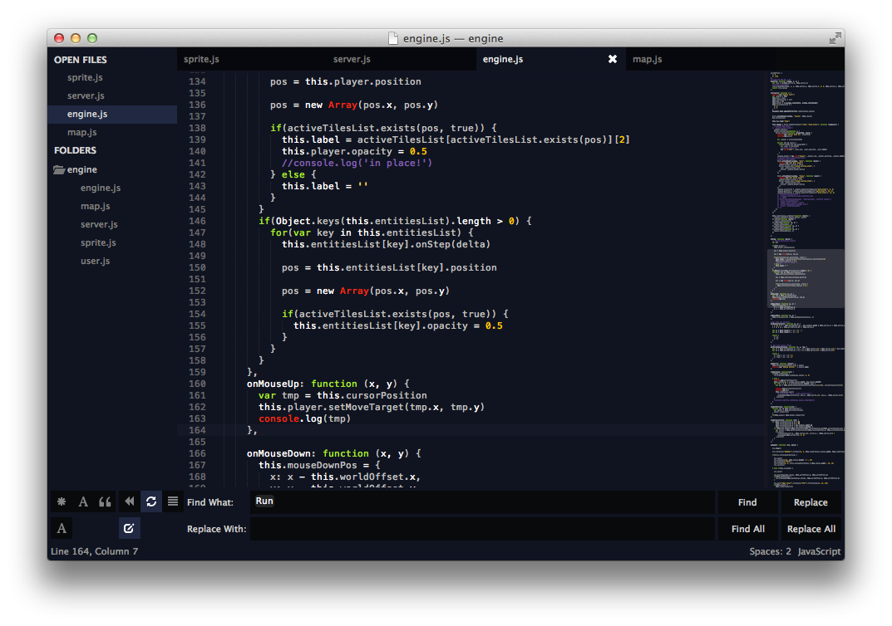
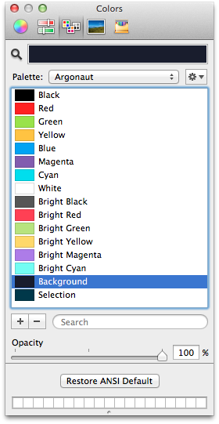

Argonaut Color Scheme
==============

Color Scheme to use with:
 - [OS X Terminal](#os-x-terminal)
 - [iTerm2](#iterm2)
 - [Midnight Commander](#midnight-commander)
 - [Sublime Text 2/3](#sublime-text-23)
 - [Apple Color Picker](#apple-color-picker)

---

## OS X Terminal

## iTerm2
Modified version of the [iTerm-argonaut](https://github.com/effkay/iTerm-argonaut) theme from [Felipe Kaufmann](https://github.com/effkay)

## Midnight Commander
> Install
Copy 'asterisk.ini' to `~/.local/share/mc/skins` or `/usr/[local]/share/mc/skins`
Edit the `~/.config/mc/ini
- set the `skin` property of `Midnight-Commander` section to `asterisk`

## Sublime Text 2/3
[Argonaut](https://github.com/pwaleczek/Argonaut) Sublime Text Theme

## Apple Color Picker

